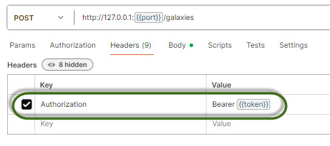

# starzz-fastapi

This is a REST API backend created using Python's FastAPI framework.

### The Dataset

This project uses a database of fictional galaxies, constellations and stars.  

Here is a diagram to describe the tables and their relationships:

Stars are located in constellations, which are in turn located in galaxies.

The `galaxies`, `constellations` and `stars` tables contain the additional
fields `added_by` and `verified_by` to indicate the id of the users who made
the finding and verified it, respectively.

The database was created using SQLite.  The scripts to create the tables and
load the dummy data are included in `assets` for reference.  Note that the primary
keys of each table should actually increment automatically but are simply defined
as `INTEGER` and `PRIMARY KEY`, like so:

    CREATE TABLE users (
        user_id INTEGER,
        ...
        PRIMARY KEY (user_id)
    );
    
    CREATE TABLE galaxies (
        galaxy_id INTEGER,
        ...
        PRIMARY KEY (galaxy_id),
        ...
    );
    
    CREATE TABLE constellations (
        constellation_id INTEGER,
    ...
    PRIMARY KEY (constellation_id),
    );
    
    CREATE TABLE stars (
        star_id INTEGER,
        ...
        PRIMARY KEY (star_id),
        ...
    );

because in SQLite, if a column is defined as `INTEGER` 
and `PRIMARY KEY`, there is no need to 
define it as `AUTO_INCREMENT`.

### The Application

All code committed at each chapter is available with the commit message of the chapter name.

#### Chapter 1: Setting up the routes

Python libraries added:

    fastapi
    uvicorn

We set up the project structure as follows:

    assets           -> contains the application's assets
    app              
    |_ main.py       -> the main module for the application
    |_ controllers   -> modules to handle application logic
    |_ routers       -> modules to handle application requests

The module `main.py` contains code to dispatch the requests to the application, to the classes 
in `routers`:

    ...
    from routers import constellations, galaxies, stars, users
    
    app = FastAPI()
    
    app.include_router(constellations.router)
    app.include_router(galaxies.router)
    app.include_router(stars.router)
    app.include_router(users.router)
    ...

A sample module in the `routers` package is `users.py`.  It contains the functions to 
handle the requests to the `/users` endpoints:

    ...
    from app.controllers import users
    
    
    router = APIRouter(
        prefix="/users",
        tags=["users"],
    )
    
    
    @router.post("/", status_code=status.HTTP_201_CREATED)
    async def register_user() -> dict[str, str]:
        """Handle POST method."""
        return users.handle_post()
    
    
    @router.get("/", status_code=status.HTTP_200_OK)
    async def list_users() -> dict[str, str]:
        """Handle GET method."""
        return users.handle_list()
    ...

The different requests are then forwarded to different functions in `users.py` in the `controllers` package.

    ...
    def handle_post() -> dict[str, str]:
        """Handle the POST request."""
        return {
            "message": "User successfully registered."
        }

    def handle_list() -> dict[str, str]:
        """Handle the GET request."""
        return {
            "input": "ALL",
            "message": "Users successfully retrieved."
        } 
    ...

The other modules in the `routers` package follow a similar logic.

#### Chapter 2: Setting up the database

Python libraries added:

    sqlmodel

We include the package `dependencies`, `models` and `schemas` to our project:

    assets           -> contains the application's assets
    app              
    |_ main.py       -> the main module for the application
    |_ controllers   -> modules to handle application logic
    |- dependencies  -> package to contain application dependencies
    |_ models        -> modules for classes to be used to abstract the database tables
    |_ routers       -> modules to handle application requests
    |_ schemas       -> modules for Pydantic classes to describe input and output

We first define `database.py` in package `dependncies` to be the interface to the database:
    
    """Ths module is responsible for the application's integration with the database."""
    import pathlib
    from typing import Any, Generator
    
    from sqlmodel import Session, create_engine
    
    from app.dependencies import constants
    
    # allow FastAPI to use the same SQLite database in different threads
    connect_args = dict(check_same_thread=False)
    
    basedir = pathlib.Path(__file__).parent.resolve()
    
    # specify the location of the database file
    database_uri = constants.SQLITE_URI.format(basedir)
    
    engine = create_engine(database_uri, connect_args=connect_args)
    
    def get_session() -> Generator[Session, Any, None]:
        """Yield a database session."""
        with Session(engine) as session:
            yield session

The database is saved as `dependencies/db.sqlite3`.

The modules in the `schemas` package define Pydantic classes to accept user input and dictate 
application output (the classes actually inherit from `SQLModel` but since they don't define 
ORM classes, they are essentially Pydantic classes).  In these modules, we take advantage of 
inheritance so we don't keep repeating the fields.  Here is a snippet from `constellations.py`:

    ...
    class ConstellationsBase(SQLModel):
        """Base class for Constellations* schemas."""
        constellation_name: str = Field(index=True)
    
    
    class ConstellationsForCreate(ConstellationsBase):
        """Class to be used for adding a new Constellations object."""
        galaxy_id: int
        added_by: int
        verified_by: int | None = None
    ...

In the `models` package we define ORM classes that map to database tables.  However, 
we cannot split each class into its own module so we combine all the classes in the 
module `orm_classes.py`.  Here is the definition of the class `Constellations` that 
maps to the database table `constellations`; the class' attributes correspond to
the table's columns (the appropriate attributes are also set as primary/foreign keys):

    ...
    class Constellations(ConstellationsBase, table=True):
        """ORM class for constellations table."""
        constellation_id: int | None = Field(default=None, primary_key=True)
        galaxy_id: int = Field(foreign_key="galaxies.galaxy_id")
        added_by: int = Field(foreign_key=constants.USER_ID)
        verified_by: int | None = Field(default=None, foreign_key=constants.USER_ID)
    ...

The class also defines relationships with other classes:

    ... 
        galaxy_info: Galaxies = Relationship(back_populates="members")
        added_by_info: Users = Relationship(
            back_populates="constellations_added",
            sa_relationship_kwargs = {"foreign_keys": "Constellations.added_by"})
        verified_by_info: Users | None = Relationship(
            back_populates="constellations_verified",
            sa_relationship_kwargs={"foreign_keys": "Constellations.verified_by"})
    
        members: list["Stars"] = Relationship(back_populates="constellation_info")
    ...

The `Relationship` classes have references to the other ORM classes.  Suppose we had written each 
class in its own module.  This class would then be in `constellations.py`.  Since the class 
needs the definition of class `Stars` for example, we would have to import the module having 
class `Stars`, say in `stars.py`.  However, class `Stars` defines its own `Relationship` classes 
referencing the other ORM classes, including the class `Constellations`.  Thus, `stars.py` would 
have to import `constellations.py`.  We would then have a "circular import".  To avoid this, we 
write all the ORM classes in a single module.

The CRUD and listing functions for `Constellations`, `Galaxies`, `Stars` and `Users` objects contain 
essentially the same code.  To avoid having to repeat code in each of the four ORM classes, we 
create the module `crud_and_listing.py` in package `models`.  Each function in this module is generic; 
each function can accept as argument an instance of one of the four classes.  Here's an example:

    ... 
    MODELS = Constellations | Galaxies | Stars | Users
    MODEL_CLASSES = (Constellations.__class__ | Galaxies.__class__ |
                     Stars.__class__ | Users.__class__)
    SCHEMAS_FOR_CREATE = (c.ConstellationsForCreate | g.GalaxiesForCreate |
                          s.StarsForCreate | u.UsersForCreate)
    
    def create(class_: MODEL_CLASSES,
               session: Session, data: SCHEMAS_FOR_CREATE) -> MODELS:
        """The Create operation."""
        new_obj = class_.model_validate(data)
        session.add(new_obj)
        session.commit()
        session.refresh(new_obj)
        return new_obj
    ...

The functions in `constellations.py` in the `controllers` package had minor changes.  Previously, 
when these functions were called, they simply returned a generic response. The functions now call 
the corresponding functions of `crud_and_listing.py` in the `models` package.  For example:
    
    ...
    def handle_post(session: Session, data: c.ConstellationsForCreate) -> orm_classes.Constellations:
        """Handle the POST request."""
        return crud_and_listing.create(orm_classes.Constellations, session, data)
    ...

The `handle_post()` function calls the generic `create()` function. It then returns an 
appropriate response depending on the function's return value.

The other modules in the `controllers` package are similar.

The modules in the `routers` package also needed changes.  Whereas before, the functions in the 
modules simply dispatched the user's requests to the appropriate function in the `controllers` 
package, the functions are now a bit more involved.  Here is an example function in 
`constellations.py` to handle POST requests:

    ...
    @router.post("/", status_code=status.HTTP_201_CREATED,
                 response_model=c.ConstellationsLongInfo)
    async def register_constellation(data: c.ConstellationsForCreate,
                                     session: Session = Depends(database.get_session)
                                     ) -> orm_classes.Constellations:
        """The return is actually the model but is converted to the desired schema."""
        return constellations.handle_post(session, data)
    ...

In the decorator, we add the parameter `status_code` to specify the default HTTP status code 
of the function's response, and `response_model` to be the schema of said response.  We then 
declare the function to accept `data` and `session` as parameters, and return a `Constellations` 
object.  The `data` parameter is from the user's request and should conform to the `ConstellationsForCreate` 
schema.  The `session` parameter is a session to the database and is automatically supplied by 
the application.  The function calls `handle_post()` in `constellations.py` of the `controllers` 
package.

The other modules in the `routers` package are similar.

#### Chapter 3: Setting up password hashing

Python libraries added:

    bcrypt
    passlib

For security, we need to save the hash of the users' passwords, not the actual passwords.  We
use the `passlib` library for this.  We add a new module `hashing.py` to the `dependencies` package:

    ...
    pwd_ctx = CryptContext(schemes=["bcrypt"], deprecated="auto")
    
    
    def bcrypt(password: str) -> str:
        """Return a hash of the password."""
        return pwd_ctx.hash(password)
    
    
    def verify(hashed_password: str, plaintext_string: str) -> bool:
        """Check whether the given plaintext string equals the hashed password."""
        return pwd_ctx.verify(plaintext_string, hashed_password)

This module is a helper module for password hashing and verification.

In `users.py` of the `controllers` package, we modify the functions that register new users and 
update existing users.  We first hash the password in the data received (if the password exists),
before forwarding the data.  For example:

    ...
    def handle_post(session: Session, data: u.UsersForCreate) -> orm_classes.Users:
        """Handle the POST request."""
        encrypt_password(data)
        return crud_and_listing.create(orm_classes.Users, session, data)
    
    
    def encrypt_password(data: u.UsersForCreate | u.UsersForUpdate) -> None:
        """Encrypt the password before writing it to the database."""
        plaintext_password = getattr(data, "password")
        if plaintext_password:
            setattr(data, "password", hashing.bcrypt(plaintext_password))
    ...

In `users.py` of the `schemas` package, we modify the `UsersLongInfo` schema so that 
the user's password will not be displayed when the user's information is retrieved:

    ...
    class UsersLongInfo(UsersShortInfo):
        """Class to be used for displaying a User's complete info."""
        email: str
        first_name: str
        last_name: str
        date_of_birth: str
    ...

#### Chapter 4: Setting up authorization using JWT

Python libraries added:

    python-multipart
    pyjwt

We use JWT (JSON Web Token) to protect our sensitive endpoints.  Every time we receive a request 
for one of these endpoints, we inspect the request's headers to see whether it contains a JWT.  
If it does, we authorize (i.e. allow) the request to access the endpoint; otherwise we block the 
request and raise an error.

The JWT encodes information about the requestor.  Therefore, to generate the JWT we need to know 
the identity of a user.  We require a user to log in to the application.  Upon successful authentication
(i.e. we know who the user is), we generate a JWT containing his identity.  The user then includes 
the JWT in subsequent requests. For user identification, we can use OAuth2.  

To summarize, in this application we use OAuth2 for authentication and JWT for authorization.

We begin by modifying `main.py` to include a route for logging in:

    ...
    app.include_router(auth.router)
    ...

In `auth.py` of `routers` package, we call `handle_login()` in `auth.py` of the `controllers` package:

    ...
    @router.post("/")
    async def login_to_get_access_token(
            form_data: OAuth2PasswordRequestForm = Depends(),
            session: Session = Depends(database.get_session)) -> a.Token:
        """ Returns a JWT upon successful login. """
        return auth.handle_login(form_data, session)

We pass in the form where the user entered his username and password.  We also pass a 
database session.

In `auth.py` of the `controllers` package, we define this function:

    ...
    def handle_login(
            form_data: OAuth2PasswordRequestForm, session: Session) -> dict[str, str]:
        """Handle the login attempt; return a JWT if successful, otherwise raise an error."""
        data = security.authenticate_user(
            crud_and_listing.get_user_by_username(session, form_data.username), form_data.password)
        if not data:
            raise exceptions.CannotBeAuthenticatedError()
    
        access_token = security.create_access_token(
            data={"sub": f'{data["username"]}, id={data["user_id"]}'},
            expiry_in_minutes=constants.JWT_ACCESS_TOKEN_EXPIRE_MINUTES
        )
    
        return {"access_token": access_token, "token_type": "bearer"}

We try to authenticate the user.  We first retrieve the user with the given username.  To do this, 
in `crud_and_listing.py` of the `models` package, we add a function to search users by username:

    ...
    def get_user_by_username(session: Session, username: str) -> Users:
        """Get the user with the given username."""
        return session.exec(select(Users).filter(Users.username == username)).first()

After we get the correct user, we then validate whether the password is correct.  To do this, in 
`security.py` of the `dependencies` package, we add this function:

    ...
    def authenticate_user(user: orm_classes.Users, plaintext_password: str) -> dict[str, str] | None:
        """Return a dict of user_id and username if the user is authenticated, otherwise return None."""
        if user and hashing.verify(user.password, plaintext_password):
            return {"user_id": user.user_id, "username": user.username}
        return None
    ...

This calls the `verify()` function in the `hashing.py` module (also in the `dependencies` package) 
to check whether the given password matches the user's hashed password saved in the database.  If 
so, we return the user's id and username.

Going back to `handle_login()` in `auth.py` of the `controllers` package: when the authentication 
is successful, we generate a JWT.  The user's id and username are encoded in this token.  To do this, in 
`security.py` of the `dependencies` package, we add this function:

    ...
    def create_access_token(data: dict[str, str | datetime], expiry_in_minutes: int) -> str:
        """Create a JWT access token"""
        expiry = datetime.now(timezone.utc) + timedelta(minutes=expiry_in_minutes)
        to_encode = data.copy()
        to_encode.update({"exp": expiry})
        encoded_jwt = jwt.encode(to_encode, constants.JWT_SECRET_KEY,
                                 algorithm=constants.JWT_ALGORITHM)
        return encoded_jwt
    ...

The user then includes the token in the header of the user's subsequent requests.

Now that we are able to provide JWTs to users, we can implement protection of our endpoints.
We add this function to `security.py` of the `dependencies` package:

    ...
    def get_current_user(token: str = Depends(oauth2_scheme)) -> str:
        """Extract the user's identity from the JWT."""
        try:
            payload = jwt.decode(token, constants.JWT_SECRET_KEY,
                                 algorithms=[constants.JWT_ALGORITHM])
            identity = payload.get("sub")
            if not identity:
                raise InvalidSubjectError
        except (InvalidTokenError, InvalidSubjectError):
            raise exceptions.UnauthorizedError()
        return identity
    ...

This function depends on `oauth2_scheme()`, which we have defined at the top of `security.py`:

    ...
    oauth2_scheme = OAuth2PasswordBearer(tokenUrl="auth")
    ...

This object takes as argument, the url of the route for user login.  The object is also a Python
callable, thus we are able to make it a dependency of our `get_current_user()` function.  When 
the object is called, it extracts the token from the request's headers.  If it is successful, it 
returns the token to the caller.

We now make `get_current_user()` a dependency of our sensitive endpoints.  This function returns 
the identity encoded in the token.  For endpoints where we don't need the identity (i.e. we only 
need to protect the endpoint), we assign the function's return value to `_`.  Examples of these 
can be found in `galaxies.py` of the `routers` package

    ...
    @router.put("/{galaxy_id}", status_code=status.HTTP_202_ACCEPTED,
                response_model=g.GalaxiesLongInfo)
    async def update_galaxy(galaxy_id: int, data: g.GalaxiesForUpdate,
                            session: Session = Depends(database.get_session),
                            _: str = Depends(security.get_current_user)
                            ) -> orm_classes.Galaxies:
        """The return is actually the model but is converted to the desired schema."""
        return galaxies.handle_put(session, data, galaxy_id)
    
    
    @router.delete("/{galaxy_id}", status_code=status.HTTP_204_NO_CONTENT)
    async def delete_galaxy(galaxy_id: int,
                            session: Session = Depends(database.get_session),
                            _: str = Depends(security.get_current_user)
                            ) -> None:
        """Handle DELETE method."""
        return galaxies.handle_delete(session, galaxy_id)

However, if we need the identity, we assign the return value to `current_user`:

    ...
    @router.post("/", status_code=status.HTTP_201_CREATED,
                 response_model=g.GalaxiesLongInfo)
    async def register_galaxy(data: g.GalaxiesForCreate,
                              session: Session = Depends(database.get_session),
                              current_user: str = Depends(security.get_current_user)
                              ) -> orm_classes.Galaxies:
        """The return is actually the model but is converted to the desired schema."""
        data.added_by = int(current_user.split("id=")[1])
        return galaxies.handle_post(session, data)
    ...

In this function, we parse out the user's id from `current_user` and set it as the data's `added_by`.

Similar changes were done in the rest of the modules of the `routers` package.

### References

Please refer to the documentations for more information.

- FastAPI documentation at https://fastapi.tiangolo.com/
- SQLModel documentation at https://sqlmodel.tiangolo.com/
